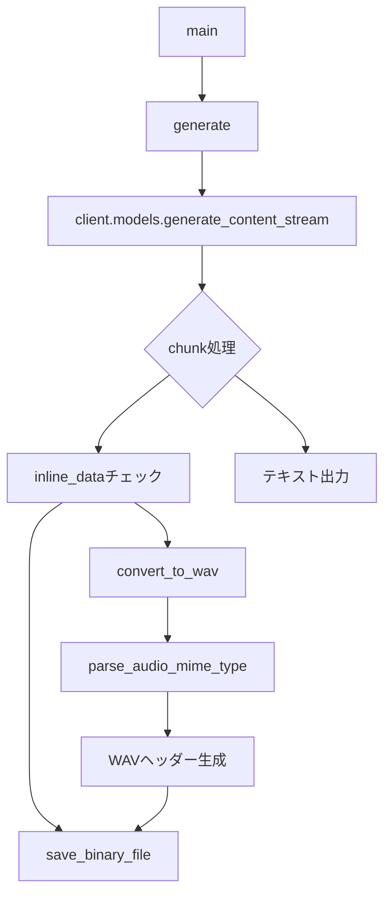
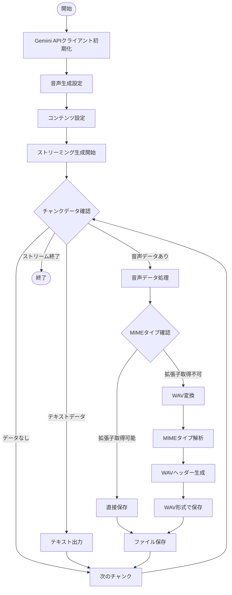

# all_voices.py 処理概要

## ファイル概要
`all_voices.py`は、Google Gemini APIを使用してマルチスピーカー音声合成を行うPythonスクリプトです。テキストから音声を生成し、生成された音声データをWAVファイルとして保存します。

## 主要機能
- Google Gemini 2.5 Flash Preview TTSモデルを使用した音声生成
- マルチスピーカー対応（kazu: Enceladus音声、AI: Sulafat音声）
- 音声データのストリーミング受信
- 音声ファイルの自動保存（WAV形式）
- MIMEタイプの解析とWAVヘッダー生成

## クラス・メソッド構成



## 処理フロー



## 主要メソッド詳細

### `generate()`
- **目的**: メイン処理関数
- **処理内容**:
  1. Gemini APIクライアントの初期化
  2. マルチスピーカー音声設定の構成
  3. ストリーミング音声生成の実行
  4. 受信データの処理とファイル保存

### `save_binary_file(file_name: str, data: bytes)`
- **目的**: バイナリデータをファイルに保存
- **処理内容**: 指定されたファイル名でバイナリデータを書き込み

### `convert_to_wav(audio_data: bytes, mime_type: str) -> bytes`
- **目的**: 音声データをWAV形式に変換
- **処理内容**:
  1. MIMEタイプから音声パラメータを解析
  2. WAVファイルヘッダーを生成
  3. 音声データと結合してWAV形式のバイトデータを返却

### `parse_audio_mime_type(mime_type: str) -> dict[str, int | None]`
- **目的**: 音声MIMEタイプから音声パラメータを抽出
- **処理内容**:
  - サンプルレート（rate）の抽出
  - ビット深度（bits_per_sample）の抽出
  - デフォルト値: 16bit, 24000Hz

## 設定詳細

### 音声設定
- **モデル**: `gemini-2.5-flash-preview-tts`
- **スピーカー設定**:
  - kazu: Enceladus音声
  - AI: Sulafat音声
- **温度**: 1（自然な音声生成）
- **出力形式**: audio

### ファイル出力
- **命名規則**: `ENTER_FILE_NAME_{index}{extension}`
- **対応形式**: WAV（デフォルト）、その他MIMEタイプに応じた拡張子
- **保存場所**: スクリプト実行ディレクトリ

## 依存関係
- `google.genai`: Google Gemini API
- `mimetypes`: MIMEタイプ処理
- `struct`: バイナリデータ構造化
- `base64`, `os`, `re`: 標準ライブラリ

## 使用方法
```bash
python all_voices.py
```

環境変数`GEMINI_API_KEY`にGoogle Gemini APIキーを設定する必要があります。
